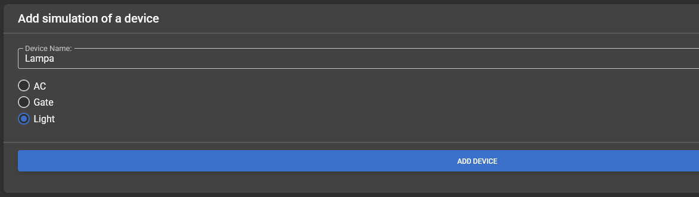
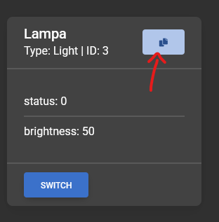
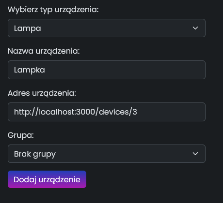
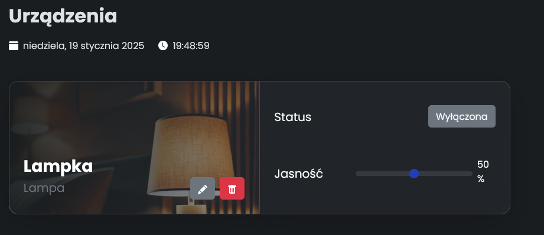
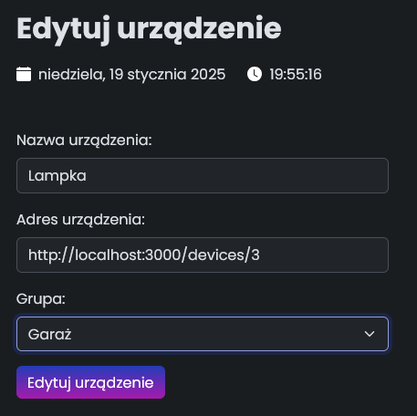
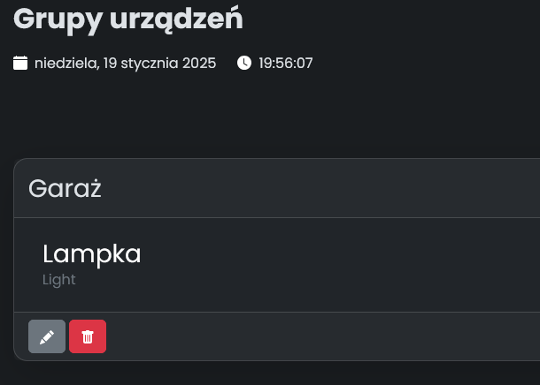

# SmartHaven

## Opis

aplikacja ułatwia zarządzanie inteligentnym domem, pozwalając na zdalne sterowanie oświetleniem, bramami z dowolnego
miejsca.

Jej mocne strony to:

- prosty interfejs,
- pełna kompatybilność z urządzeniami (komputer, smartfon),
- możliwość automatyzacji codziennych czynności, takich jak ustawianie temperatury klimatyzacji czy otwieranie bram.

Aplikacja zwiększa komfort życia, oszczędza czas i zapewnia bezpieczeństwo dzięki natychmiastowym powiadomieniom i
solidnym zabezpieczeniom. To idealne rozwiązanie dla osób, które chcą mieć pełną kontrolę nad swoim domem w sposób łatwy
i bezpieczny.

## Jak uruchomić

1. Sklonuj repozytorium
2. ```bash
    > cd DeviceSimulators
    > npm install
    > cd ..
    ```
2. ```bash
    > docker-compose up
    ```
3. Aplikacja będzie dostępna pod adresem: http://localhost:8080, a symulatory pod adresem: http://localhost:3000

## Jak dodać nowe urządzenie
1. Dodaj nowe urządzenie w symulatorze. Wybierz odpowiedzni typ urządzenia.



2. Odśwież stronę.
3. Kliknij na niebieski przycisk aby skopiowac adres urządzenia.



4. Przejdź do aplikacji i kliknij na przycisk "Dodaj urządzenie" w menu po lewej stronie.
5. Wpisz nazwę urządzenia i wklej adres urządzenia oraz wybierz odpowiedni tryb pokrywający się z wcześniej utworzoną symulacją urządzenia.



6. Kliknij "Dodaj urządzenie".
7. Urządzenie zostanie dodane do listy urządzeń.



## Dodawanie grupy urządzeń do urządzania

1. Grupa musi być już utworzona. Jeśli nie, przejdź do zakładki "Dodaj grupę" i wpisz nazwę nowej grupy następnie zatwierdź przyciskiem "Dodaj grupę".
2. Kliknij na przycisk z ikoną ołówka na urządzeniu.


3. Wybierz grupę z listy rozwijanej i zatwierdź przyciskiem "Edytuj urządzenie".



4. Urządzenie zostanie przypisane do wybranej grupy.


